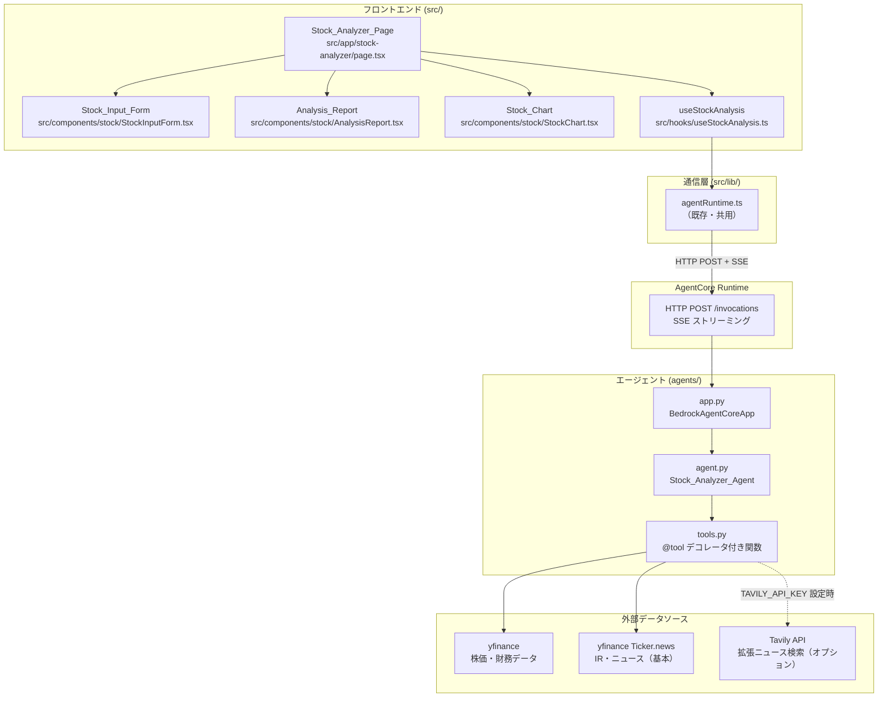
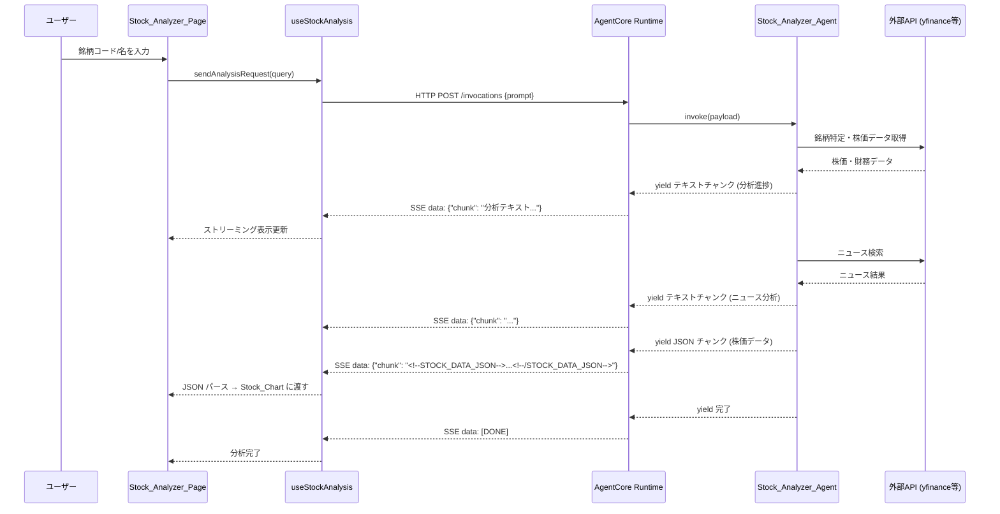

# 設計ドキュメント: 日本株分析AIエージェント

## 概要

日本株分析AIエージェント機能は、既存の Amplify Gen 2 + Strands Agents SDK アーキテクチャを活用し、銘柄入力から総合分析レポート・株価チャート表示までを提供する。

システムは3つのレイヤーで構成される:

1. **フロントエンド（Next.js）**: 銘柄入力フォーム、分析レポート表示、株価チャート描画
2. **AgentCore Runtime**: エージェントの実行基盤。フロントエンドからの HTTP POST + SSE 通信を受け付ける
3. **Python エージェント（Strands SDK）**: 外部 API を通じた株価データ取得、財務指標分析、ニュース検索、総合評価を実行

既存の `sample_agent` パターンを踏襲し、`agents/jp_stock_agent/` に新規エージェントを配置する。フロントエンドは `src/app/stock-analyzer/` に専用ページを追加し、既存の AgentCore Runtime 通信基盤（`useAgentChat`, `agentRuntime.ts`）を拡張して利用する。

### 設計判断

- **チャートライブラリ**: Recharts を採用。React ネイティブで軽量、Next.js との相性が良く、折れ線グラフ・バーチャート・ツールチップの要件を満たす。既存の依存関係（React 19）と互換性がある
- **株価データ API**: yfinance（Python）を採用。日本株の株価データ・財務指標を無料で取得可能。エージェントのツールとして `agents/` 内でのみ使用する
- **ニュース検索**: yfinance の `Ticker.news` プロパティをベースに関連ニュースを取得（追加の API キー不要）。より充実した検索が必要な場合は、オプションで Tavily API（`TAVILY_API_KEY` 環境変数）による拡張検索をサポートする
- **株価データの受け渡し**: エージェントが JSON 構造化データを SSE ストリーム内の特別なマーカー付きチャンクとして送信し、フロントエンドがパースしてチャートに描画する

## アーキテクチャ



### データフロー



## コンポーネントとインターフェース

### フロントエンド コンポーネント

#### 1. Stock_Analyzer_Page (`src/app/stock-analyzer/page.tsx`)

分析ページのルートコンポーネント。銘柄入力、分析レポート、株価チャートを統合する。

```typescript
// ページ状態管理
interface StockAnalyzerPageState {
  query: string;           // ユーザー入力（銘柄コードまたは銘柄名）
  analysisText: string;    // ストリーミング中の分析テキスト
  stockData: StockDataPoint[] | null;  // パース済み株価データ
  isAnalyzing: boolean;    // 分析中フラグ
  error: string | null;    // エラーメッセージ
}
```

#### 2. Stock_Input_Form (`src/components/stock/StockInputForm.tsx`)

```typescript
interface StockInputFormProps {
  onSubmit: (query: string) => void;
  disabled: boolean;
}
```

#### 3. Analysis_Report (`src/components/stock/AnalysisReport.tsx`)

```typescript
interface AnalysisReportProps {
  content: string;       // Markdown 形式の分析テキスト
  isStreaming: boolean;  // ストリーミング中かどうか
}
```

#### 4. Stock_Chart (`src/components/stock/StockChart.tsx`)

```typescript
interface StockChartProps {
  data: StockDataPoint[];
}
```

#### 5. useStockAnalysis フック (`src/hooks/useStockAnalysis.ts`)

既存の `useAgentChat` パターンを参考に、株式分析専用のフックを実装する。SSE ストリーム内の JSON マーカーを検出し、テキストと株価データを分離する。

```typescript
interface UseStockAnalysisReturn {
  analysisText: string;
  stockData: StockDataPoint[] | null;
  isAnalyzing: boolean;
  error: string | null;
  analyze: (query: string) => Promise<void>;
}
```

### エージェント コンポーネント

#### 1. app.py (`agents/jp_stock_agent/app.py`)

既存の `sample_agent/app.py` と同一パターン。`BedrockAgentCoreApp` のエントリーポイントとして SSE ストリーミングを提供する。

#### 2. agent.py (`agents/jp_stock_agent/agent.py`)

```python
def create_agent() -> Agent:
    """日本株分析エージェントを生成する"""
    # system_prompt: 分析手順、出力フォーマット、JSON マーカー規約を指示
    # tools: [search_stock, get_stock_prices, get_financial_metrics,
    #         search_news, get_sector_peers]
```

#### 3. tools.py (`agents/jp_stock_agent/tools.py`)

各ツール関数は `@tool` デコレータ付きで独立して定義する。

```python
@tool
def search_stock(query: str) -> str:
    """銘柄コードまたは銘柄名から日本の上場企業を特定する"""

@tool
def get_stock_prices(ticker_code: str) -> str:
    """過去1年分の日次株価データと移動平均線を取得し、JSON形式で返す"""

@tool
def get_financial_metrics(ticker_code: str) -> str:
    """PER、PBR、ROE、配当利回り等の財務指標を取得する"""

@tool
def search_news(company_name: str, ticker_code: str) -> str:
    """対象企業の直近IR・ニュース情報を取得する。
    yfinance の Ticker.news をベースとし、TAVILY_API_KEY が設定されている場合は
    Tavily API による拡張検索結果も含める。"""

@tool
def get_sector_peers(ticker_code: str) -> str:
    """同業種の主要上場企業を特定し、財務指標を比較する"""
```

### 通信インターフェース

#### SSE ストリーム内の株価データ受け渡し規約

エージェントは分析テキストと株価 JSON データを同一の SSE ストリームで送信する。株価データは特別なマーカーで囲む:

```
通常のテキストチャンク...
<!--STOCK_DATA_JSON-->{"prices":[...],"moving_averages":{...}}<!--/STOCK_DATA_JSON-->
残りのテキストチャンク...
```

フロントエンドの `useStockAnalysis` フックがマーカーを検出し、JSON 部分をパースして `stockData` に格納する。マーカー外のテキストは `analysisText` に蓄積する。

## データモデル

### フロントエンド型定義 (`src/types/stock.ts`)

```typescript
/** 日次株価データポイント */
export interface StockDataPoint {
  date: string;        // "YYYY-MM-DD"
  open: number;        // 始値
  high: number;        // 高値
  low: number;         // 安値
  close: number;       // 終値
  volume: number;      // 出来高
  ma5: number | null;  // 5日移動平均
  ma25: number | null; // 25日移動平均
  ma75: number | null; // 75日移動平均
  ma200: number | null; // 200日移動平均
}

/** エージェントから受信する株価データJSON構造 */
export interface StockDataPayload {
  ticker_code: string;
  company_name: string;
  prices: StockDataPoint[];
}
```

### エージェント側データ構造（Python）

```python
# get_stock_prices ツールの出力 JSON 構造
{
    "ticker_code": "7203",
    "company_name": "トヨタ自動車",
    "prices": [
        {
            "date": "2024-07-01",
            "open": 3200.0,
            "high": 3250.0,
            "low": 3180.0,
            "close": 3230.0,
            "volume": 15000000,
            "ma5": 3210.0,
            "ma25": 3150.0,
            "ma75": 3050.0,
            "ma200": 2900.0
        }
        // ... 約250営業日分
    ]
}
```

### 移動平均線の算出ロジック

- 各移動平均線は終値（close）の単純移動平均（SMA）で算出
- データ開始からN日未満の期間は `null` を設定（例: 5日移動平均は最初の4日間が `null`）
- 算出は `get_stock_prices` ツール内で yfinance から取得した生データに対して行う


## 正確性プロパティ

*プロパティとは、システムのすべての有効な実行において成り立つべき特性や振る舞いのことである。人間が読める仕様と機械的に検証可能な正確性保証の橋渡しとなる。*

### Property 1: 銘柄検索の入力解決

*任意の*有効な銘柄コード（4桁数字）または有効な銘柄名に対して、`search_stock` ツールは企業名と銘柄コードの両方を含む結果を返す。

**Validates: Requirements 1.2, 1.3**

### Property 2: 無効入力のエラー検出

*任意の*存在しない銘柄コード（例: "0000", "9999" 等の未使用コード）または意味のない文字列に対して、`search_stock` ツールはエラーを示す結果を返し、有効な企業情報を返さない。

**Validates: Requirements 1.4**

### Property 3: 財務指標の完全性

*任意の*有効な銘柄コードに対して、`get_financial_metrics` ツールの出力は PER、PBR、ROE、配当利回り、時価総額、売上高、営業利益、純利益、自己資本比率のフィールドを含む（値が取得不可の場合は null を許容するが、フィールド自体は存在する）。

**Validates: Requirements 2.1, 2.2**

### Property 4: 株価データ構造の完全性

*任意の*有効な銘柄コードに対して、`get_stock_prices` ツールの出力 JSON は以下を満たす:
- 各データポイントが date, open, high, low, close, volume, ma5, ma25, ma75, ma200 フィールドを含む
- データポイントが日付昇順にソートされている
- 移動平均線フィールド（ma5, ma25, ma75, ma200）が含まれる

**Validates: Requirements 3.1, 10.1, 10.2**

### Property 5: 移動平均線の算出正確性

*任意の*終値の配列と期間 N に対して、算出された N 日移動平均値は直近 N 個の終値の算術平均と等しい。また、データポイント数が N 未満のインデックスでは移動平均値は null である。

**Validates: Requirements 3.2**

### Property 6: 同業種比較データの完全性

*任意の*有効な銘柄コードに対して、`get_sector_peers` ツールの出力は 3 社以上の同業種企業を含み、各企業について PER、PBR、ROE、配当利回り、時価総額の比較フィールドを含む。

**Validates: Requirements 6.1, 6.2**

### Property 7: スコア整合性

*任意の*分析結果に対して、総合スコアは 0〜100 の範囲内であり、ファンダメンタルズスコア（0〜30）+ テクニカルスコア（0〜25）+ IR・ニューススコア（0〜20）+ 同業種比較スコア（0〜25）の合計と等しい。各カテゴリスコアはそれぞれの上限以内である。

**Validates: Requirements 7.1, 7.2**

### Property 8: スコアと判断ラベルの対応

*任意の*総合スコア（0〜100）に対して、生成される投資判断ラベルは「強気・やや強気・中立・やや弱気・弱気」のいずれかであり、スコアが高いほどポジティブなラベルが対応する（単調性）。

**Validates: Requirements 7.4**

### Property 9: 株価データ JSON ラウンドトリップ

*任意の*有効な `StockDataPayload` オブジェクトに対して、JSON にシリアライズしてからパースした結果は元のオブジェクトと等価である。

**Validates: Requirements 10.4**

## エラーハンドリング

### エージェント側

| エラー状況 | 対応 |
|---|---|
| 銘柄が見つからない | エラーメッセージを返し、再入力を促す（要件 1.4） |
| 一部の財務データが取得不可 | 取得できなかった項目を明示し、取得可能なデータで分析を継続（要件 2.4） |
| 株価データが1年分未満 | 取得可能な期間で分析を実行し、データ期間を明示（要件 3.4） |
| IR・ニュースが取得不可 | 情報が取得できなかった旨を明示（要件 5.3） |
| 外部 API タイムアウト/エラー | エラーをログに記録し、該当分析項目をスキップして残りを継続（要件 9.5） |

### フロントエンド側

| エラー状況 | 対応 |
|---|---|
| 認証トークン取得失敗 | 認証エラーメッセージを表示（既存パターン踏襲） |
| SSE 通信エラー | エラーメッセージを表示し、再試行ボタンを提供（要件 8.4） |
| JSON パース失敗 | 株価データマーカー内の不正 JSON はスキップし、テキスト分析のみ表示 |
| Runtime ARN 未設定 | 設定案内メッセージを表示（既存パターン踏襲） |

### SSE ストリーム内のエラー伝播

エージェント内でツールエラーが発生した場合、エージェントはエラー内容をテキストチャンクとしてストリームに含める（例: 「※ 財務データの一部が取得できませんでした」）。フロントエンドは通常のテキストとして表示する。致命的なエラー（エージェント自体のクラッシュ）は AgentCore Runtime が SSE エラーイベントとして返し、`useStockAnalysis` フックの `onError` で処理する。

## テスト戦略

### テストアプローチ

ユニットテストとプロパティベーステストの二本立てで網羅的にカバーする。

### プロパティベーステスト

- **ライブラリ**: Python 側は `hypothesis`、TypeScript 側は `fast-check`
- **各テスト最低 100 回のイテレーション**
- **各テストに設計ドキュメントのプロパティ番号をタグ付け**
  - タグ形式: `Feature: jp-stock-analyzer, Property {number}: {property_text}`
- **各正確性プロパティは単一のプロパティベーステストで実装する**

#### Python 側（agents/）

| プロパティ | テスト内容 |
|---|---|
| Property 1 | ランダムな有効銘柄コード/名に対して search_stock が企業情報を返す |
| Property 2 | ランダムな無効入力に対して search_stock がエラーを返す |
| Property 3 | 有効な銘柄に対して get_financial_metrics が必須フィールドを含む |
| Property 4 | 有効な銘柄に対して get_stock_prices が正しい構造の JSON を返す |
| Property 5 | ランダムな終値配列に対して移動平均線の算出が数学的に正しい |
| Property 6 | 有効な銘柄に対して get_sector_peers が 3 社以上の比較データを返す |
| Property 7 | ランダムなカテゴリスコアに対して総合スコアの整合性を検証 |
| Property 8 | ランダムなスコアに対して判断ラベルの単調性を検証 |

#### TypeScript 側（src/）

| プロパティ | テスト内容 |
|---|---|
| Property 9 | ランダムな StockDataPayload に対して JSON ラウンドトリップの等価性を検証 |

### ユニットテスト

ユニットテストは具体的な例、エッジケース、統合ポイントに焦点を当てる。プロパティベーステストが広範な入力をカバーするため、ユニットテストは最小限に抑える。

#### Python 側

- `search_stock`: 既知の銘柄コード（例: "7203"）で正しい企業名が返ることを確認
- `get_stock_prices`: 既知の銘柄で返却データの日付範囲が妥当であることを確認
- 外部 API エラー時のグレースフルデグラデーション（モック使用）
- 移動平均線: データ不足時の null 値（エッジケース）

#### TypeScript 側

- `StockInputForm`: 空入力での送信防止
- `StockChart`: 有効なデータでのレンダリング確認
- `useStockAnalysis`: SSE ストリーム内の JSON マーカー検出とパース
- `AnalysisReport`: 免責事項テキストの表示確認
- ローディング状態の遷移（分析中 → 完了）
