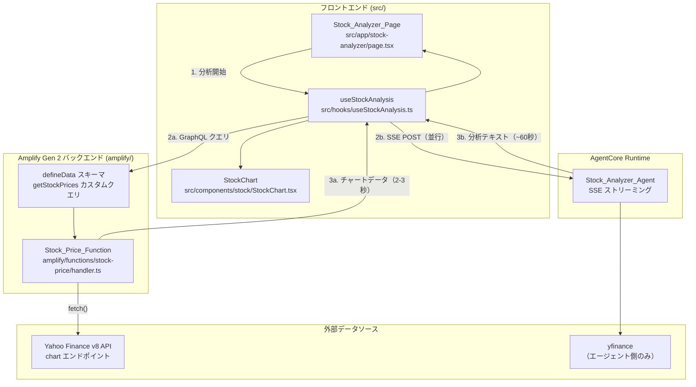
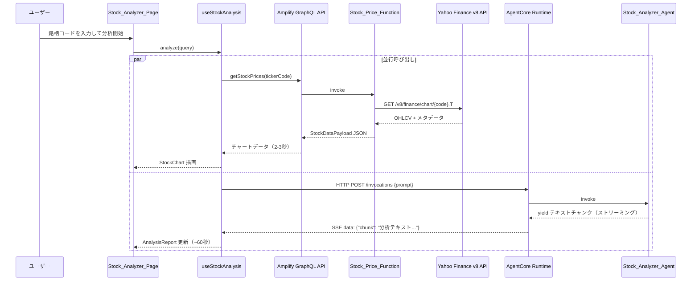

# 設計ドキュメント: 株価チャートプリフェッチ

## 概要

本機能は、日本株分析ページの体感待ち時間を大幅に短縮するための並行データ取得アーキテクチャを導入する。

現状、株価チャートデータはエージェントのSSEストリーム内でLLM処理完了後（約60秒）に届く。本設計では、Amplify Gen 2の`defineFunction`で定義したTypeScript Lambda関数（Stock_Price_Function）をGraphQLカスタムクエリのリゾルバとして公開し、フロントエンドからエージェント呼び出しと並行してLambdaを呼び出すことで、チャートを2〜3秒で表示する。

### 設計判断

- **株価データソース（Lambda）**: Yahoo Finance v8 API を `fetch()` で直接呼び出す。yfinanceはPython専用のため、TypeScript Lambdaでは使用不可。Yahoo Finance v8 APIは `https://query1.finance.yahoo.com/v8/finance/chart/{symbol}` エンドポイントで日次OHLCVデータを無料で取得可能
- **Amplify統合パターン**: `defineFunction` + `defineData`のカスタムクエリパターンを採用。既存のTodoモデルと同じスキーマ内にカスタムクエリを追加し、`amplify/backend.ts`でfunctionリソースを登録する
- **フォールバック戦略**: Lambda APIが失敗した場合、従来のSSEストリーム内JSONマーカー検出ロジックにフォールバックする。これにより後方互換性を維持する
- **エージェント側の簡略化**: チャートデータがLambdaから提供されるため、エージェントの`get_stock_prices`ツールからJSONマーカーブロックを削除し、テクニカル分析用テキスト要約のみを返すよう変更する

## アーキテクチャ



### データフロー（並行呼び出し）




## コンポーネントとインターフェース

### 1. Stock_Price_Function (`amplify/functions/stock-price/handler.ts`)

Amplify Gen 2の`defineFunction`で定義するTypeScript Lambda関数。銘柄コードを受け取り、Yahoo Finance v8 APIから株価データを取得して`StockDataPayload`互換のJSONを返す。

```typescript
// amplify/functions/stock-price/resource.ts
import { defineFunction } from "@aws-amplify/backend";

export const stockPriceFunction = defineFunction({
  name: "stock-price",
  entry: "./handler.ts",
  timeoutSeconds: 15,
  memoryMB: 256,
});
```

```typescript
// amplify/functions/stock-price/handler.ts
import type { AppSyncResolverHandler } from "aws-lambda";

interface GetStockPricesArgs {
  tickerCode: string;
}

interface StockDataPoint {
  date: string;
  open: number;
  high: number;
  low: number;
  close: number;
  volume: number;
  ma5: number | null;
  ma25: number | null;
  ma75: number | null;
  ma200: number | null;
}

interface StockDataPayload {
  ticker_code: string;
  company_name: string;
  prices: StockDataPoint[];
}

export const handler: AppSyncResolverHandler<GetStockPricesArgs, string> = async (event) => {
  const { tickerCode } = event.arguments;
  // 1. Yahoo Finance v8 API からOHLCVデータ取得
  // 2. 移動平均線を算出
  // 3. StockDataPayload形式のJSONを返却
  // エラー時はエラーメッセージを含むJSONを返却
};
```

### 2. カスタムクエリ定義 (`amplify/data/resource.ts` への追加)

既存のスキーマに`getStockPrices`カスタムクエリを追加する。

```typescript
// amplify/data/resource.ts に追加
const schema = a.schema({
  // 既存のTodoモデル
  Todo: a.model({ ... }),

  // 株価データ取得カスタムクエリ
  getStockPrices: a
    .query()
    .arguments({ tickerCode: a.string().required() })
    .returns(a.string())  // JSON文字列として返却
    .authorization((allow) => [allow.authenticated()])
    .handler(a.handler.function(stockPriceFunction)),
});
```

### 3. useStockAnalysis フック変更 (`src/hooks/useStockAnalysis.ts`)

既存フックに並行呼び出しロジックを追加する。

```typescript
// 変更後のインターフェース（既存と同一、内部実装のみ変更）
export interface UseStockAnalysisReturn {
  analysisText: string;
  stockData: StockDataPayload | null;
  isAnalyzing: boolean;
  isLoadingChart: boolean;
  error: string | null;
  analyze: (query: string) => Promise<void>;
}
```

変更点:
- `analyze`関数内で`Promise.allSettled`を使い、GraphQLクエリとSSE通信を並行実行
- GraphQLクエリ成功時は即座に`stockData`をセットし、`isLoadingChart`を`false`に
- GraphQLクエリ失敗時は従来のSSEマーカー検出ロジックにフォールバック
- 両方からデータが来た場合はGraphQL側を優先（`stockDataSourceRef`で管理）

### 4. amplify/backend.ts 変更

```typescript
import { defineBackend } from '@aws-amplify/backend';
import { auth } from './auth/resource.js';
import { data } from './data/resource.js';
import { stockPriceFunction } from './functions/stock-price/resource.js';

defineBackend({
  auth,
  data,
  stockPriceFunction,
});
```

### 5. エージェント側 tools.py 変更

`get_stock_prices`ツールから`<!--STOCK_DATA_JSON-->...<!--/STOCK_DATA_JSON-->`マーカーブロックを削除し、テクニカル分析用テキスト要約のみを返すよう変更する。

## データモデル

### 既存型定義（変更なし）: `src/types/stock.ts`

```typescript
export interface StockDataPoint {
  date: string;        // "YYYY-MM-DD"
  open: number;        // 始値
  high: number;        // 高値
  low: number;         // 安値
  close: number;       // 終値
  volume: number;      // 出来高
  ma5: number | null;  // 5日移動平均
  ma25: number | null; // 25日移動平均
  ma75: number | null; // 75日移動平均
  ma200: number | null; // 200日移動平均
}

export interface StockDataPayload {
  ticker_code: string;
  company_name: string;
  prices: StockDataPoint[];
}
```

### Yahoo Finance v8 API レスポンス構造

Lambda関数が受け取るYahoo Finance v8 APIのレスポンス構造:

```typescript
interface YahooFinanceChartResponse {
  chart: {
    result: Array<{
      meta: {
        symbol: string;
        shortName?: string;
        longName?: string;
        currency: string;
        regularMarketPrice: number;
      };
      timestamp: number[];  // Unix timestamp配列
      indicators: {
        quote: Array<{
          open: (number | null)[];
          high: (number | null)[];
          low: (number | null)[];
          close: (number | null)[];
          volume: (number | null)[];
        }>;
      };
    }>;
    error: { code: string; description: string } | null;
  };
}
```

### Lambda → GraphQL レスポンス

カスタムクエリは`a.string()`型で定義するため、Lambda関数は`StockDataPayload`をJSON文字列にシリアライズして返す。フロントエンドで`JSON.parse()`してから使用する。

### 移動平均線の算出ロジック（Lambda内）

- 各移動平均線は終値（close）の単純移動平均（SMA）で算出
- データ開始からN日未満の期間は`null`を設定
- 算出はLambda関数内でYahoo Finance APIから取得した生データに対して行う
- NaN、Infinity、undefinedは含めない（nullは許容）
- prices配列は日付昇順でソート


## 正確性プロパティ

*プロパティとは、システムのすべての有効な実行において成り立つべき特性や振る舞いのことである。人間が読める仕様と機械的に検証可能な正確性保証の橋渡しとなる。*

### Property 1: StockDataPayload構造の完全性

*任意の*有効なOHLCVデータ（Yahoo Finance v8 APIレスポンス形式）に対して、Lambda関数の変換結果は`StockDataPayload`型に準拠し、各データポイントがdate、open、high、low、close、volume、ma5、ma25、ma75、ma200の全フィールドを含む。

**Validates: Requirements 1.1, 1.2, 1.3**

### Property 2: GraphQLデータソース優先

*任意の*`useStockAnalysis`フックの実行において、GraphQL API（Stock_Data_API）とSSEストリーム（エージェント）の両方から株価データが取得された場合、フックが公開する`stockData`はGraphQL APIから取得したデータである。

**Validates: Requirements 3.5**

### Property 3: エージェント出力にJSONマーカーを含まない

*任意の*有効な銘柄コードに対して、変更後の`get_stock_prices`ツールの出力は`<!--STOCK_DATA_JSON-->`および`<!--/STOCK_DATA_JSON-->`マーカー文字列を含まず、テクニカル分析用テキスト要約のみを返す。

**Validates: Requirements 5.1, 5.2**

### Property 4: StockDataPayload JSONラウンドトリップ

*任意の*有効な`StockDataPayload`オブジェクトに対して、`JSON.stringify`でシリアライズしてから`JSON.parse`でパースした結果は元のオブジェクトと等価である。

**Validates: Requirements 6.1**

### Property 5: 数値フィールドにNaN・Infinityを含まない

*任意の*Lambda関数が返す`StockDataPayload`のprices配列内の各データポイントに対して、数値フィールド（open、high、low、close、volume）はNaN、Infinity、undefinedのいずれでもない（nullは許容する）。

**Validates: Requirements 6.2**

### Property 6: prices配列の日付昇順ソート

*任意の*Lambda関数が返す`StockDataPayload`のprices配列に対して、各要素のdateフィールドは前の要素のdateフィールド以上である（昇順ソート不変条件）。

**Validates: Requirements 6.3**

## エラーハンドリング

### Lambda関数側

| エラー状況 | 対応 |
|---|---|
| 銘柄コードが4桁数字でない | バリデーションエラーメッセージを含むJSONを返す |
| 銘柄コードに対応する上場企業が存在しない | Yahoo Finance APIが空データを返した場合、銘柄が見つからない旨のエラーメッセージを返す（要件1.5） |
| Yahoo Finance v8 APIがタイムアウト | fetchのAbortControllerで10秒タイムアウトを設定し、タイムアウトエラーメッセージを返す（要件1.6） |
| Yahoo Finance v8 APIがHTTPエラーを返す | HTTPステータスコードとエラー内容を含むメッセージを返す（要件1.6） |
| APIレスポンスのJSONパース失敗 | パースエラーメッセージを返す |

### フロントエンド側

| エラー状況 | 対応 |
|---|---|
| GraphQLクエリ失敗（ネットワークエラー等） | SSEストリーム内のJSONマーカーにフォールバック（要件3.4） |
| GraphQLクエリのレスポンスJSONパース失敗 | フォールバックに切り替え |
| SSEストリームもGraphQLも株価データなし | ローディングインジケーターを非表示にし、チャートは表示しない（要件4.4） |
| 認証トークン取得失敗 | 既存の認証エラーメッセージを表示（変更なし） |

### エージェント側

| エラー状況 | 対応 |
|---|---|
| get_stock_pricesツールのエラー | テクニカル分析用テキスト要約のエラーメッセージを返す（既存動作を維持） |

## テスト戦略

### テストアプローチ

ユニットテストとプロパティベーステストの二本立てで網羅的にカバーする。

### プロパティベーステスト

- **ライブラリ**: TypeScript側は`fast-check`、Python側は`hypothesis`
- **各テスト最低100回のイテレーション**
- **各テストに設計ドキュメントのプロパティ番号をタグ付け**
  - タグ形式: `Feature: stock-chart-prefetch, Property {number}: {property_text}`
- **各正確性プロパティは単一のプロパティベーステストで実装する**

#### TypeScript側（Lambda関数 + フロントエンド）

| プロパティ | テスト内容 |
|---|---|
| Property 1 | ランダムなOHLCVデータ配列に対して、変換関数が全必須フィールドを含むStockDataPayloadを返す |
| Property 2 | ランダムな2つのStockDataPayloadに対して、GraphQL側とSSE側の両方がセットされた場合、フックがGraphQL側を公開する |
| Property 4 | ランダムなStockDataPayloadに対して、JSON.stringify→JSON.parseのラウンドトリップが等価 |
| Property 5 | ランダムなOHLCVデータ（NaN、Infinity含む）に対して、変換後の数値フィールドにNaN・Infinityが含まれない |
| Property 6 | ランダムな日付配列に対して、変換後のprices配列が日付昇順でソートされている |

#### Python側（エージェントツール）

| プロパティ | テスト内容 |
|---|---|
| Property 3 | ランダムな銘柄コードに対して、変更後のget_stock_pricesの出力にJSONマーカー文字列が含まれない（モック使用） |

### ユニットテスト

ユニットテストは具体的な例、エッジケース、統合ポイントに焦点を当てる。

#### TypeScript側

- Lambda handler: 既知の銘柄コード（例: "7203"）でのモックAPIレスポンス変換
- Lambda handler: 存在しない銘柄コードでのエラーレスポンス（要件1.5）
- Lambda handler: APIタイムアウト時のエラーハンドリング（要件1.6）
- 移動平均線算出: データ不足時のnull値（エッジケース）
- useStockAnalysis: GraphQL失敗時のSSEフォールバック動作（要件3.4）
- useStockAnalysis: ローディング状態の遷移（要件4.1〜4.4）
- SSEマーカー検出: 従来のマーカーが存在する場合の後方互換性（要件5.3）

#### Python側

- get_stock_prices: 変更後の出力にマーカーが含まれないことの確認
- get_stock_prices: テクニカル要約テキストの内容確認（終値、移動平均線、トレンド等）

